# Configuring EIGRP

## Project Overview
This project focuses on configuring Enhanced Interior Gateway Routing Protocol (EIGRP) in a simulated network environment using Cisco Packet Tracer. The objectives outlined below will guide you through the necessary steps to set up and optimize EIGRP across multiple routers.

## Objectives

### 1. Device Configuration
- Configure the appropriate **hostnames** and **IP addresses** on each device.
- **Enable router interfaces** to ensure connectivity.

### 2. Loopback Interface Setup
- Configure a **loopback interface** on each router:
  - R1: 1.1.1.1/32
  - R2: 2.2.2.2/32
  - (Continue for additional routers as necessary)
  

### 3. EIGRP Configuration
- Configure **EIGRP** on each router:
  - Disable **auto-summary**.
  - Enable EIGRP on each interface, including loopback interfaces.
  - Configure **passive interfaces** where appropriate (including loopback interfaces).

### 4. Load-Balancing Configuration
- Configure R1 to perform **unequal-cost load-balancing** when sending network traffic to **192.168.4.0/24**.
  
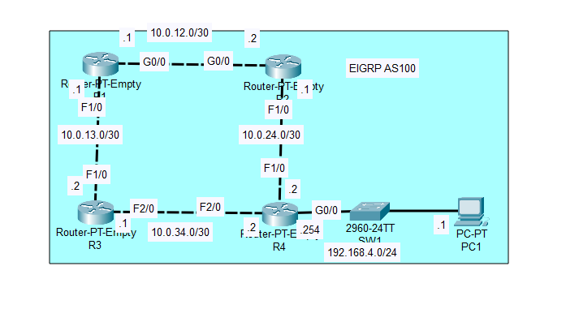

## Getting Started
### 1. Device configuration
- To configure PC1 click on it, go to the Config tab and assign R1's IP as default gateway, then select the FastEthernet0 tab and assign the appropriate IP.

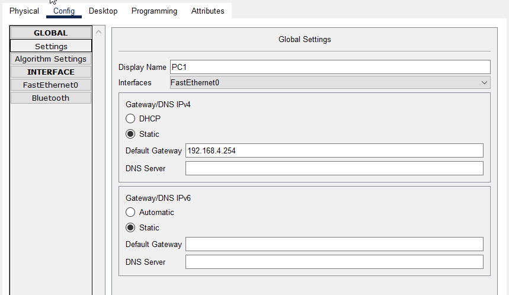
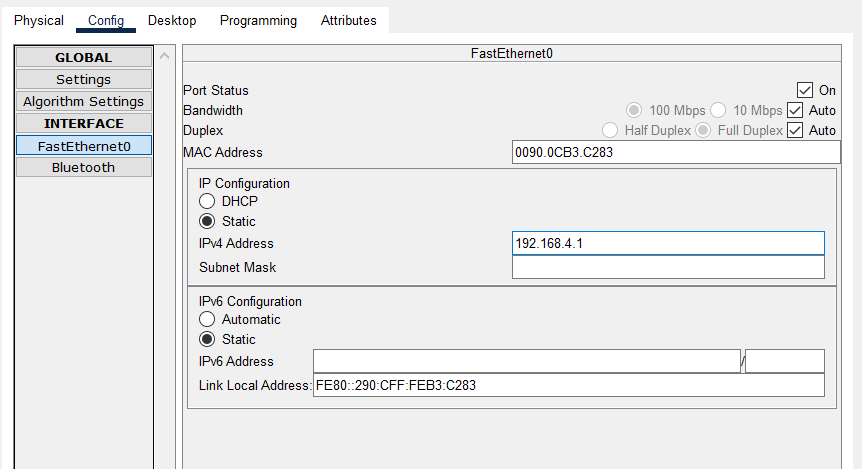

- Next we must configure the router, open the CLI of R1 and assign the appropriate IP for each interface, repeat for all four routers.

**R1**

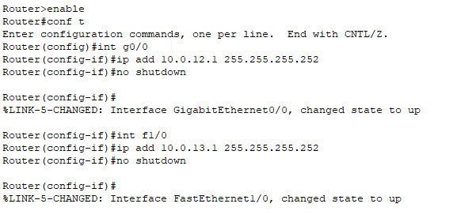

**R2**

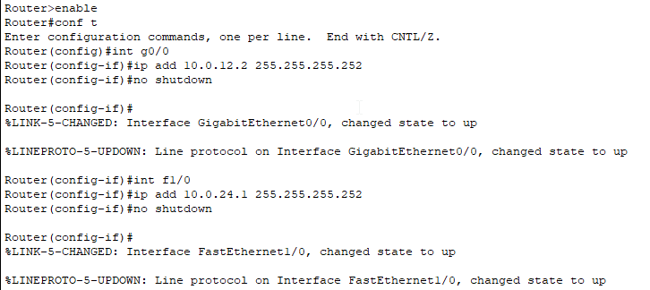

**R3**

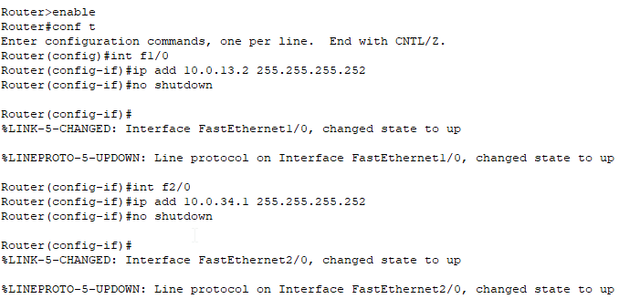

**R4**

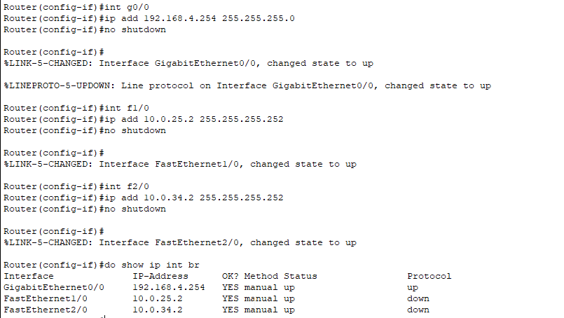

### 2. Loopback Interface Setup
- To configure a loopback interface we can use the command **interface loopback <number>**, this creates the loopback interface, once inside the int loopback mode,  
we can assign an IP to it just like a regular interface:

**R1**

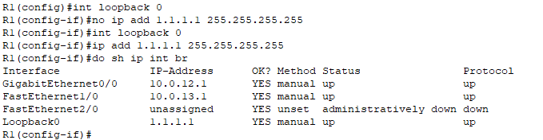

**R2**

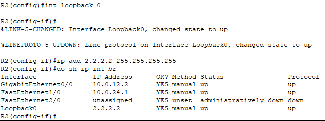

**R3**

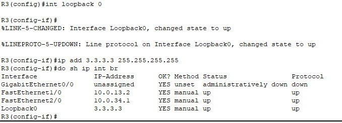

**R4**

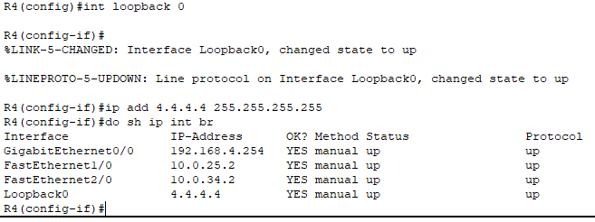

### 3. EIGRP Configuration
- Configure **EIGRP** on each router
- Disable auto-summary:  
Enter the routers CLI, from config mode by using the command **router EIGRP <AS nr.>** we can configure the EIGRP settings for the current router, our network has an
Autonomous System number of 100. In R1's case we use the command **network 10.0.12.0 0.0.0.3** to activate EIGRP on the g0/0 interface and **network 10.0.13.0 0.0.0.3**  
for the f1/0 interface (0.0.0.3 is the wildcard subnet of a /30 subnet), followed by the **no auto-summary** command to disable auto-summary. 

Repeat the steps for all the routers,  

for R2:
g0/0 -> network 10.12.0.0 0.0.0.3
f1/0 -> network 10.0.24.0 0.0.0.3

for R3:
f1/0 -> network 10.0.13.0 0.0.0.3
f2/0 -> network 10.0.34.0 0.0.0.3

for R4:
f1/0 -> network 10.0.24.0 0.0.0.3
f2/0 -> network 10.0.34.0 0.0.0.3
g0/0 -> network 192.168.4.0 0.0.0.255

(remember to include loopback addresses of each interfaces, ex. network 1.1.1.1 0.0.0.0)

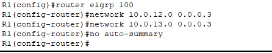

- Configure **passive interfaces** where appropriate (including loopback interfaces).
To configure an interface as passive we use the command **passive-interface <int>**, for example in R4 we should disable the loopback int  
and the g0/0 interface (as it's not connected to any router).

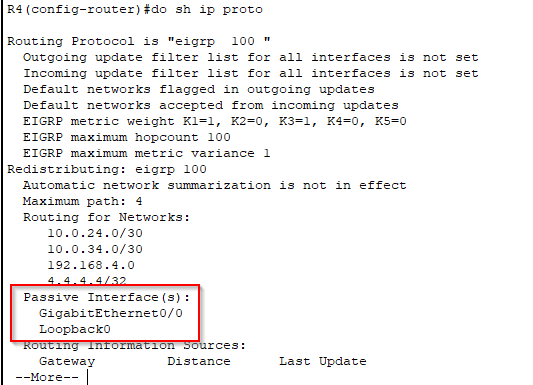

Repeat these steps do disable the loopback interfaces in R1, R2 and R3 

### 4. Load-Balancing Configuration
- Configure R1 to perform **unequal-cost load-balancing** when sending network traffic to **192.168.4.0/24**.
To do this we must simply modify the **variance metric muliplier** to allow unequal-cost load-balancing.  
From R1's EIGRP config mode use the command **variance 2** to set the variance metric multiplier to 2, this will allow 
the EIGRP to select a feasible successor that has 2x the successor route's feasible distance.

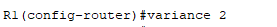

## Conclusion
By completing this project, you will gain hands-on experience in configuring EIGRP and understanding its functionalities in a network environment.
