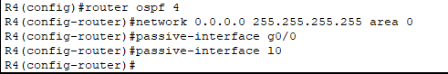

# OSPF 1 

## Objectives

Configure and analyze the Open Shortest Path First (OSPF) routing protocol in a simulated network environment. The specific objectives of the project are as follows:

1. **Device Configuration**: 
   - Configure appropriate hostnames and IP addresses on each device.
   - Enable router interfaces (excluding ISPR1).

2. **Loopback Interfaces**: 
   - Configure a loopback interface on each router:
     - R1: 1.1.1.1/32
     - R2: 2.2.2.2/32
     - (Continue with additional routers as needed)

3. **OSPF Configuration**: 
   - Enable OSPF on each router.
   - Activate OSPF on all interfaces, including loopback interfaces.
   - Ensure OSPF is not enabled on R1's Internet link.
   - Configure passive interfaces where appropriate, including loopback interfaces.

4. **ASBR Configuration**: 
   - Configure R1 as an Autonomous System Boundary Router (ASBR) that advertises a default route into the OSPF domain.

5. **Routing Table Verification**: 
   - Check the routing tables of R2, R3, and R4 to identify the default route(s) that were added as a result of the OSPF configuration.

## Project Description

The OSPF 1 project is designed to provide hands-on experience with the OSPF routing protocol, focusing on its configuration and operational characteristics in a controlled environment. Participants will engage in configuring routers, setting up OSPF, and analyzing the resulting routing tables to understand how OSPF propagates routing information.

## Getting Started

1. **Configure Devices**:
   - Assign hostnames and IP addresses to each device.
   - Enable the router interfaces (excluding ISPR1).

**R1**

**R2**

**R3**

**R4**

2. **Configure Loopback Interfaces**:
   - Set up loopback interfaces on each router with the specified IP addresses.

**R1**

**R2**

**R3**

**R4**

4. **Enable OSPF**:
   - Configure OSPF on each router, ensuring that it is enabled on all interfaces except R1's Internet link.
   - Set up passive interfaces as required.

**R1**

**R2**

**R3**

**R4**

5. **Configure R1 as ASBR**:
   - Ensure R1 advertises a default route into the OSPF domain.

6. **Verify Routing Tables**:
   - Use the appropriate commands to check the routing tables on R2, R3, and R4 to confirm the presence of the default routes.

**R2's routing table:**

**R3's routing table**

**R4's routing tables**

## Conclusion
In this project we successfully configured OSPF in a simulated network. This hands-on experience prepares us for further exploration of OSPF and advanced networking concepts (See OSPF 2).
