# OSPF 2

## Overview
This project focuses on configuring Open Shortest Path First (OSPF) routing protocol across a network of routers.

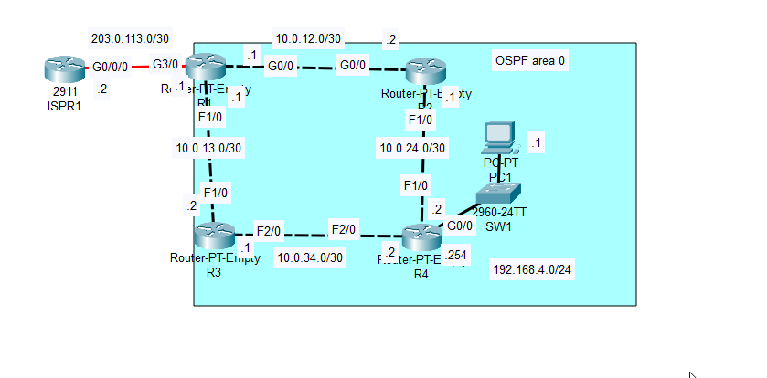

## Objectives

### 1. Device Configuration
- **Configure Hostnames and IP Addresses:** 
  - Assign appropriate hostnames 	and IP addresses to each router in the network.
  - Enable router interfaces to ensure connectivity.
  - Note: The configuration of ISPR1 is not required.

### 2. Loopback Interface Configuration
- **Create Loopback Interfaces:** 
  - Configure a loopback interface on each router with the following IP addresses:
    - R1: 1.1.1.1/32
    - R2: 2.2.2.2/32
    - R3: 3.3.3.3/32
    - R4: 4.4.4.4/32

### 3. OSPF Configuration
- **Enable OSPF on Router Interfaces:** 
  - Enable OSPF directly on each interface of the routers.
  - Configure passive interfaces as necessary to prevent OSPF from sending updates on certain interfaces.

### 4. Reference Bandwidth Configuration
- **Set OSPF Reference Bandwidth:** 
  - Configure the reference bandwidth on each router to ensure that a FastEthernet interface has a cost of 100.

### 5. ASBR Configuration
- **Configure R1 as an ASBR:** 
  - Set up R1 as an Autonomous System Boundary Router (ASBR) and configure it to advertise a default route into the OSPF domain.

### 6. Routing Table Verification
- **Check Routing Tables on R4:** 
  - Examine the routing tables of R4 to identify any default routes that have been added as a result of the OSPF configuration.

## Getting Started 

**1. Device Configuration**

**R1** 

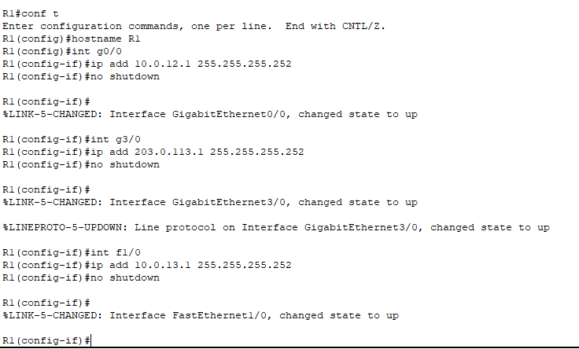

**R2**

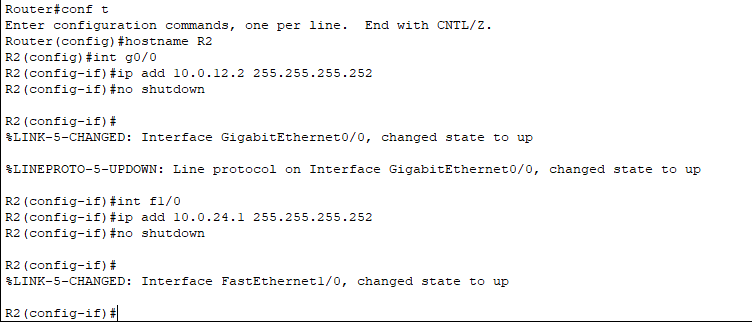

**R3**

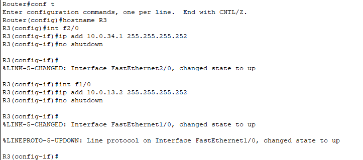

**R4**

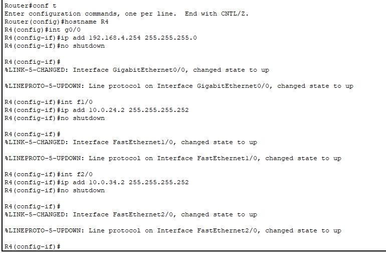

**2. Loopback Interface Configuration**

**R1**

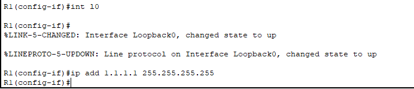

**R2**

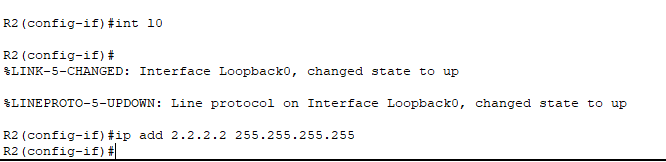

**R3**

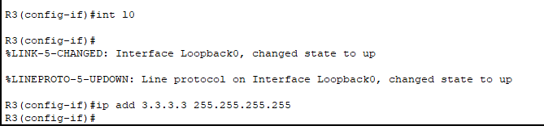

**R4**

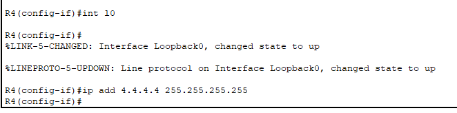

**3. OSPF Configuration**

**R1**
 
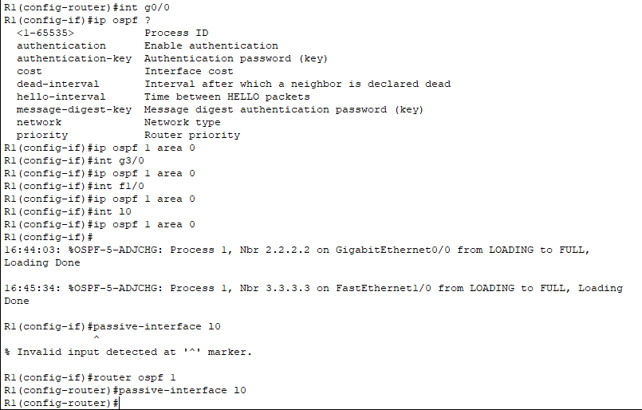

**R2**

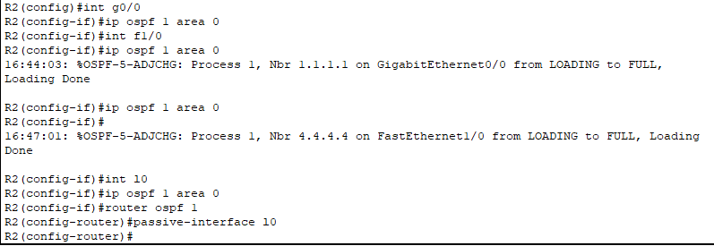

**R3**

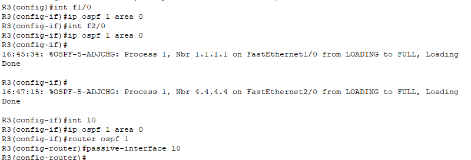

**R4**

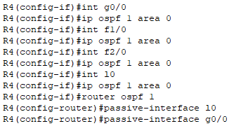

**4. Reference Bandwidth Configuration**

Since the OSPF cost is calculated by dividing the reference bandwidth (which by default is 100) with the interface bandwidth (which by default is 100), in this case 100/100 is 1, but if we set the reference bandwidth to 10000 we will have 10000/100 = 100. We can do this by using the command **auto-cost reference-bandwidth 10000** in **router ospf 1** mode

**R1**

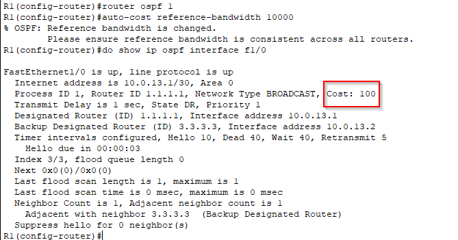

Use the same command for all the other routers

**5. ASBR Configuration**

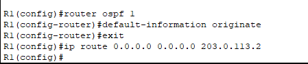

**6. Routing Table Verification**

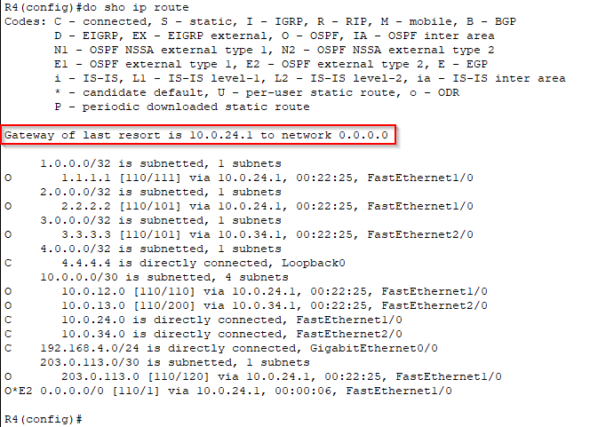

## Conclusion
The lab involved configuring OSPF across multiple routers, including setting up hostnames, IP addresses, and loopback interfaces. Key tasks included enabling OSPF on router interfaces, configuring R1 as an ASBR to advertise a default route, and verifying the routing tables.

