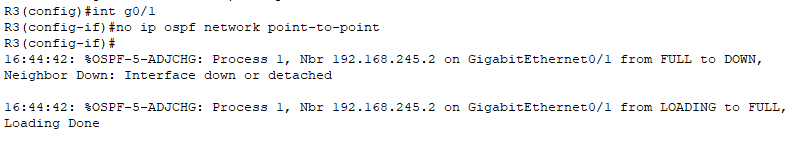

# OSPF 3 

## Overview

This project aims to configure and troubleshoot an OSPF (Open Shortest Path First) network involving multiple routers (R1, R2, R3, R4, and R5) and connected PCs (PC1 and PC2). This document outlines the objectives of the project, the steps taken to achieve them, and the expected outcomes.

## Objectives

### 1. Configure the Connection Between R1 and R2

- **Task**: Establish a serial connection between R1 and R2.
- **Configuration Steps**:
  - Set the clock rate on the serial connection to 128000.
  - Enable OSPF on both R1 and R2, ensuring they can communicate effectively.

### 2. Resolve Routing Issues for 10.0.2.0/24

- **Problem**: Only R3 has a route to the network 10.0.2.0/24.
- **Solution**: Investigate and modify the OSPF configuration to ensure that R1, R2, and R4 can also route to this network. This may involve adjusting OSPF area configurations or redistributing static routes.

### 3. Establish OSPF Neighbors Between R2, R4, and R5

- **Problem**: R2 and R4 are unable to form OSPF neighbor relationships with R5.
- **Solution**: Check and correct any issues related to OSPF configurations, such as mismatched OSPF area IDs or network statements. Ensure that the interfaces connecting these routers are correctly configured and in the same subnet.

### 4. Enable Connectivity to External Server 8.8.8.8

- **Problem**: PC1 and PC2 cannot ping the external server 8.8.8.8.
- **Solution**: Diagnose the routing and NAT (Network Address Translation) settings. Ensure that default routes are configured correctly on the routers, and verify that any firewalls are not blocking outbound traffic.

### 5. Examine the Link-State Database (LSDB)

- **Task**: Analyze the LSDB to identify the types of Link-State Advertisements (LSAs) present.
- **Expected Outcome**: Understand the network topology and the status of OSPF routes by examining the LSAs. This will help in diagnosing any issues and confirming that the OSPF configuration is functioning as intended.

## Getting Started
### Configuration Steps

1.1 **Configure the Serial Connection**:
- First we need to set ip addresses for both routers, then with the command **show controllers s0/0/0** on R1 or R2 we can check who is the DCE and who is the DTE, since R1 is the DCE we must set the clockrate from R1.
To set the clockrate to 128000 we use the command **clock-rate 128000**

- The configuration on R2:

1.2 **Enable OSPF**:
- We can enable OSPF by going in the interface we want to configure and use the command **ip ospf 1 area 0**

2.1 **Check Routing Tables**:
   - Use the **show ip route** command to verify the devices are learning new routes thanks to OSPF, from R1 we can see that new routes have been learned, 
however there are still some missing routes, for example the route to 10.0.2.0/24

2.2 **Troubleshooting**:
   - To understand why there is a missing route we can check the other routers, from the cli of R4 we check that there is a full adjacency with R3 with the command **show ip ospf neighbor**, there is (192.168.34.1 [R3] State: Full).
Next we check the routing tables with **show ip route** to see if all the routes are learned, we can see that the route to 10.0.2.0/24 is missing

It is possible that the problem is given by the fact that R3 and R4 have different network type configurations, by checking R4's network type with the command **show ip ospf 1 interface g0/1** we learn it uses a BROADCAST type, using the same command on R3 
shows that it's using the POINT-TO-POINT network type, it is likely that this is the problem:

**R4**

**R3**

- We remove the POINT-TO-POINT connection from R3 with the command **no ip ospf network point-to-point**, next we check the routing tables of R4:

**R4's routing table**

As we can see R4 now has a route to 10.0.2.0/24 via R3

4. **Verify OSPF Neighbors**:
  - Using the command **show ip ospf neighbor** on R4 we can see that R5 (192.168.245.3) is not there:

   - Let's check on R2:

  R5 doesn't show on R2 either
    
   - First thing we should do is check the network configuration on all three routers with **show ip ospf 1 int g0/0**:

R2 doesn't seem to have any misconfigurations, on to R4:

In R4's configuration nothing seems out of the ordinary, so the problem perhaps is in R5:

By showing R5's network configuration we can see the HELLO and DEAD timers don't match the ones of R2 and R4,
we can fix that by setting the correct timers:

To confirm the issue was solved, we can check R2 and R4's neighbor tables, now R5 shows up as a neighbor:

5. **Test Connectivity**:
   - If we ping 8.8.8.8 from PC1, it will say that the destination host is unreachable, perhaps the problem might be that the default route (0.0.0.0) is not set or is not advertised to the other routers (default-information originate).
Let's check R5's running-config, more specifically the ospf section:

The `default-information originate` is configure, so R5 should be sending a type 5 AS-External LSA to the other routers, could it be that R5 doesn't have a default route?
Let's check:

There's the problem, R5 is missing a default route, we can set it with the command **ip route 0.0.0.0 0.0.0.0 203.0.113.2** in R5's config mode
Let's check R1's route table to see if the default route is shown:

We can see that it learned the route from R5. Finally, let's test connectivity from PC1 to 8.8.8.8

PC1 is now able to reach destination 8.8.8.8

6. **Examine LSDB**:
   - All routers on the server will have the same LSDB, so it doesn't matter which router you check, we'll check R1:

The OSPF database has Type 1 LSAs (Router Link States), meaning each router advertises its own router LSA, 
there are Type 2 LSAs(Net Link States), the DR of each multi-access network generates this kind of LSA, 
and we have one Type 5 AS External LSA  sharing the default route from R5

## Conclusion

By following the objectives outlined in this README, you will successfully configure and troubleshoot the OSPF network, ensuring that all routers can communicate effectively and that PCs have access to external resources.
