# EtherChannel Project

## Overview

This project includes pre-configured end host and SVI IP addresses, making it easier to focus on the EtherChannel setup and routing configurations.

## Objectives

1. **Configure Layer 2 EtherChannel between ASW1 and DSW1 using LACP**: Set up as a trunk.
   
2. **Configure Layer 2 EtherChannel between ASW2 and DSW2 using PAgP**: Set up as a trunk.

3. **Configure Layer 3 EtherChannel between DSW1 and DSW2**: Utilize static EtherChannel.

4. **Configure routes**: Ensure PCs can reach SRV1.

5. **Identify default EtherChannel load-balancing methods**: Determine the default method used on each switch.

6. **Configure load-balancing**: Adjust the switches to load-balance based on source and destination IP addresses.

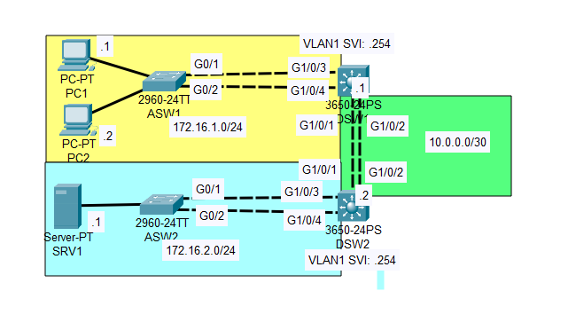

## Getting Started

### Configuration Steps

1. **Layer 2 EtherChannel Configuration**:

   - **ASW1 to DSW1**:
	First, with the command **show spanning-tree** we can see that while G0/1 is the root port  
	G0/2 is blocked by the STP.  

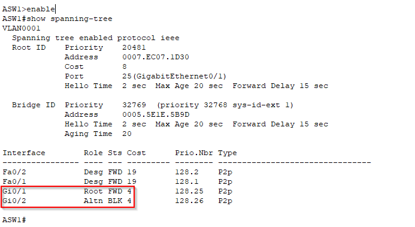

     - Use LACP to configure the EtherChannel.
	Enter the int mode and create the channel-port for the EtherChannel connection with the command  
	**channel-group 1 mode active**  
	where **active** attemps to form an active LACP connection

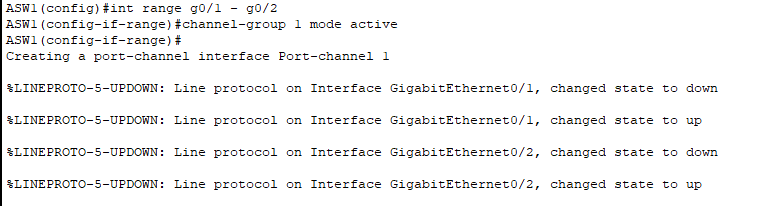

     - Set the EtherChannel interface as a trunk.
	Enter the newly formed channel-group (po1) and by using the command  
	**switchport mode trunk**  
	a new trunk connection is enstablished. Because DSW1 isn't configured yet this won't show up in  
	**show interfaces trunk**, however we can confirm it by looking at the running-config.  

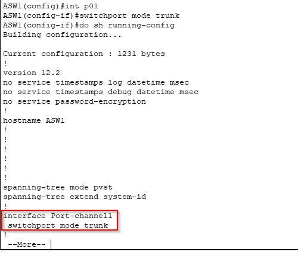

   - **DSW1 to ASW1**:
	The configuration is the same as ASW1:

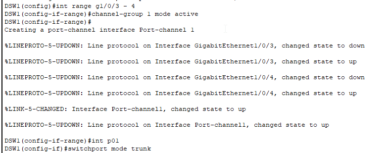

	Confirm the connection is active with **do show etherchannel summary**  
	The flags SU confirms that the connection is active.

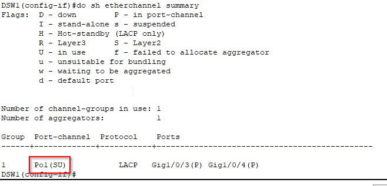

Going back to ASW1 we can confirm the etherchannel works as a single port by using the **show spanning-tree**  
command once again.

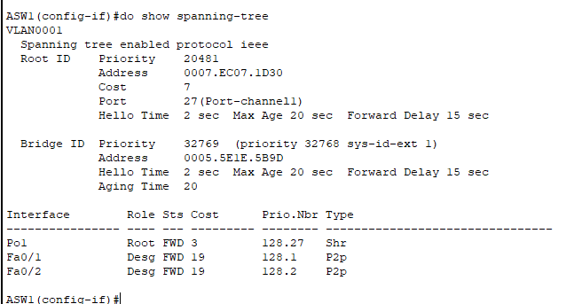

   - **ASW2 to DSW2**:
     - Use PAgP to configure the EtherChannel amd set it as a trunk port.
	The configurations of ASW2 and DSW2 will be almost identical to ASW1 and DSW1, the only difference is that we  
	will use **channel-group 1 mode desirable** instead of **channel-group 1 mode active**  

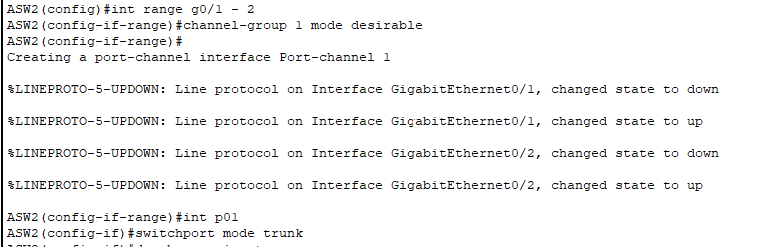

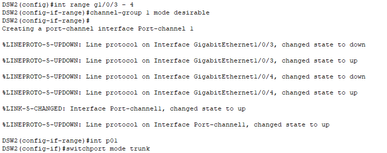

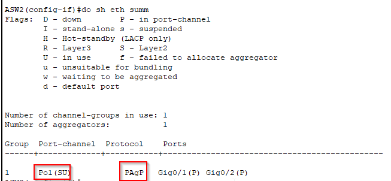

2. **Layer 3 EtherChannel Configuration**:
   - Configure static EtherChannel between DSW1 and DSW2.
	Enter the interface range g1/0/3 - 4 from DSW1. First thing we make these routed ports  
	with the command **no switchport**. Next we create a static etherchannel with the command 
	**channel-group 2 mode on** (channel-group 1 is already in use). Lastly we assign an ip address to p02:
	
	**ip add 10.0.0.2 255.255.255.252**

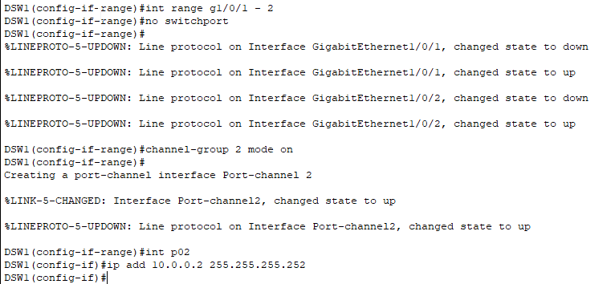

	Repeat the process on DSW2 (assign IP 10.0.0.1 255.255.255.252)

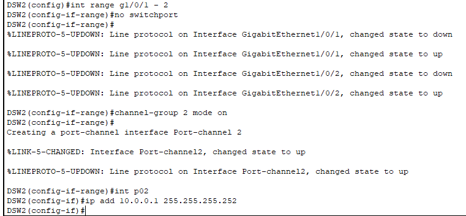

	Confirm with **do show etherchannel summary** (RU means layer 3 and active)

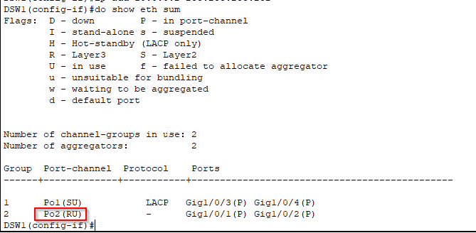

3. **Routing Configuration**:
   - Implement static routes to enable communication from PCs to SRV1.
	First step is to enable IP routing on both DSW.
	From config mode use the command **ip routing**. 
	Next we must configure a static route on DSW1 to SRV1's subnet with DSW2 as next-hop: 
	**ip route 172.16.2.0 255.255.255.0 10.0.0.1**  
	confirm with **do show ip route**

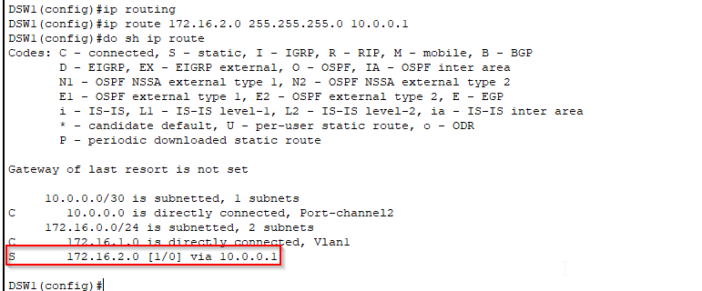

	Then we must configure a static route on DSW2 to PC1's network with DSW1 as next-hop

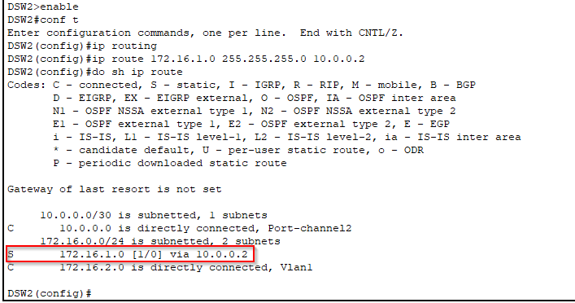

	Test connectivity sending a ping from PC1 to SRV1

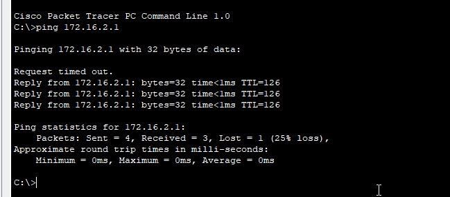

4. **Load-Balancing Configuration**:
   - Identify and configure the load-balancing method on each switch.
	We can check the load balancing method with the following command  
	**do show etherchannel load-balance**  
	the current default is source MAC Address.

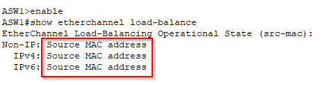

   - Set the switches to load-balance based on source and destination IP addresses.
	To change the current load-balancing method use the command **port-channel load-balance src-dst-ip**  
	Confirm with **do sh etherchannel load-balance**

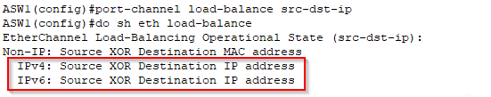

	Repeat the steps for ASW2 and DSW1-DSW2

## Conclusion

In this EtherChannel project, we successfully configured Layer 2 and Layer 3 EtherChannel connections using LACP and PAgP, ensuring efficient communication between switches and end hosts. We also implemented static routing and optimized load balancing based on source and destination IP addresses.
