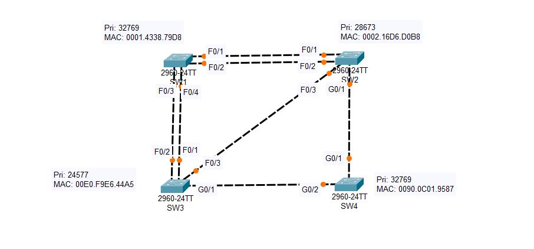
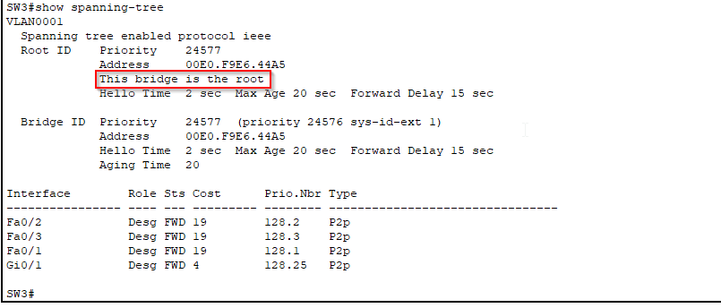
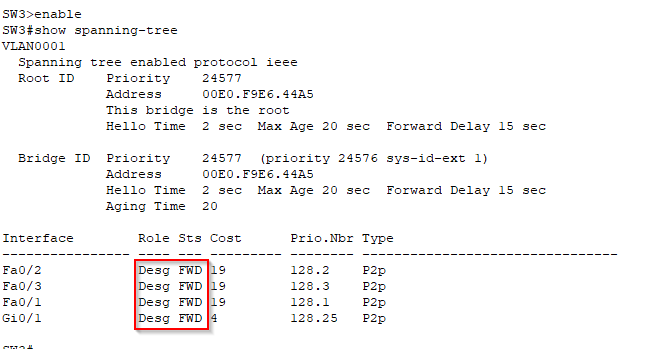
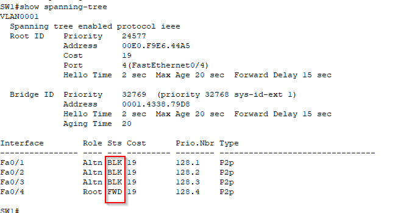
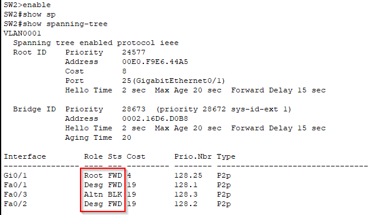
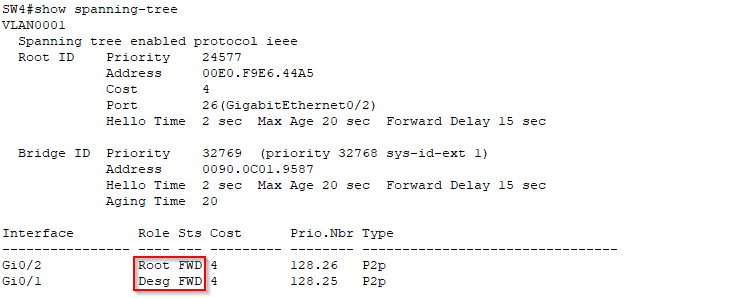

## Analyzing STP

## Project Overview
This project aims to identify the root bridge and the roles of each switch port within the network to better understand
how the STP operates.

  

## Objectives
1. *Identify the Root Bridge: Determine which switch acts as the root bridge in the STP topology.*
2. *Port Role Identification: Analyze and categorize each switch port into one of the following roles:*

    Root Port (RP)
    Designated Port (DP)
    Non-Designated Port (Blocking)

3. *CLI Confirmation: Use the command-line interface (CLI) to confirm the identified roles and the root bridge.*

## Topology
*The project utilizes a mesh topology consisting of four switches (SW1, SW2, SW3, SW4) connected as follows:*
- **SW1:** *F0/1, F0/2, F0/3, F0/4*
- **SW2:** *F0/1, F0/2, F0/3, G0/1*
- **SW3:** *F0/1, F0/2, F0/3, G0/1*
- **SW4** *G0/1. G0/2*

## Configuration Steps

### 1. Configure Switches: 

Ensure that STP is enabled on all switches. You can use the following command in the CLI for each switch:
**spanning-tree mode pvst**

### 2. Determine Root Bridge:
To determine which bridge is the root bridge we must first look at the priority number, the switch with
the lowest priority number is the root bridge, in this case it's SW3.
We can confirm this by opening a CLI on any switch and using the command: 
**show spanning-tree** 
If you use this command on SW3 for example, it will directly tell you:

### 3.Indentify Port Roles:
Analyze the output from the show spanning-tree command to determine the role of each port on the switches. 
Record the roles in the following format:

- **SW1**
    F0/1: R
    F0/2: N
    F0/3: N
    F0/4: N

- **SW2**
    F0/1: D
    F0/2: D
    F0/3: N
    G0/1: R

- **SW3**
    F0/1: D
    F0/2: D
    F0/3: D
    G0/1: D

- **SW4**
    G0/1: D
    G0/2: R

#### Determining the Root Ports (R):

Because SW3 is the Root Bridge, all SW3 ports will be designated ports (D)
Each other switch in the topology must have a single Root Port, the first criteria to determine the root port is the root cost, the interface with the lowest root cost
will become the root port.

##### SW1
Starting from SW1, via either F0/1 or F0/2 it would have a cost of 19, plus 4 for SW1's G0/1, plus 4 for SW4 G0/2 so 27 total.
Via F0/3 or F0/4 it has a cost of just 19, so the Root Port will be either F0/3 or F0/4. Since they both have the same cost port we should look at the neighbor bridge ID,
but both interfaces are connected to the same switch, SW3, as a last resort we can look at the neighbor switch's port ID, the lowest one determines the designated port.
F0/1 is lower, so that means SW1's F0/4 interface will be the Root Port (R)

##### SW2
Just like for SW1, we must determine the lower root cost, via F0/3 it has a root cost of 19, however via G0/1 it has a root cost of 4, plus 4 for SW4's G0/2, so only 8, therefore
G0/1 will be the Root Port. That also means that we can label SW4's G0/1 interface as designated, the interface connected to a Root Port is always designated.

##### SW4
SW4 Root Port is G0/2

#### Determining Designated (D) and Non-Designated (N) ports:
Every link between ports must have 1 designated port, a designated port can only be linked to a Root Port or a Nons-Designated port.

##### SW1
F0/3 is connected to the Root Bridge so it must be Non-Designated.
To determine the port roles of F0/1 and F0/2 we must first analyze the root cost, the interfaces on the switch with the lower root cost will be designated, the other side
will be Non-Designated, SW1 root cost is 19 via F0/4, however SW2's root cost is 8 via G0/1, since SW2 has the lower root cost, both it's F0/1 and F0/2 ports will be 
designated, which means that SW1's F0/1 and F0/2 will both be non-designated.

##### SW2
F0/3 is connected to the Root Bridge so it's Non-Designated
F0/1 is Designated
F0/2 is Designated

### 4. Confirm your findings:
After identifying the roles, use the CLI commands to confirm your answers.

#### **SW3**
From SW3 using the command show spanning-tree, it shows the VLAN number at the top, followed by two sections: Root ID and Bridge ID, since SW3 is the Root Bridge these section will be almost identical.
At the bottom there is a list of each interface participating in spanning tree, showing role, status, interface ID, priority num., etc.
Because this is the Root Bridge we can see that all the port roles are Designated (as shown in the role column)

#### **SW1**
With the command show spanning-tree, we can see as expected that F0/4 is the Root Port and is forwarding, the other interfaces are blocking (Altn stands for alternate, which basically means non-designated).

#### **SW2**
F0/1 and F0/2, connected to SW1, are both designated and in a forwarding state, although really these connections are disabled because SW1 is blocking those ports.
F0/3 is blocking
G0/1 is Root Port

#### **SW4**
G0/1 is Designated
G0/2 is Root Port

## Conclusion
This project provides a practical understanding of the Spanning Tree Protocol, including how to identify the root bridge and the roles of switch ports. By following the steps outlined above, users will gain valuable insights into STP operation and its importance in preventing network loops.
