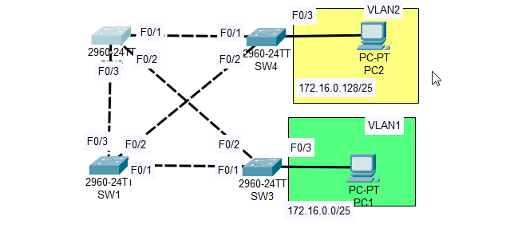
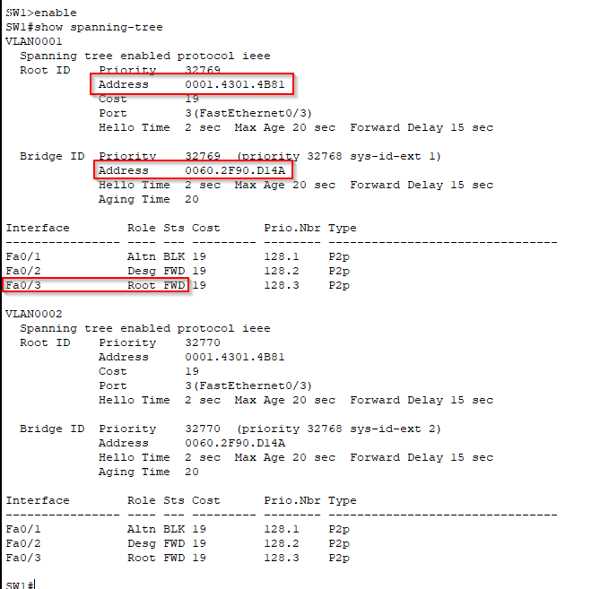
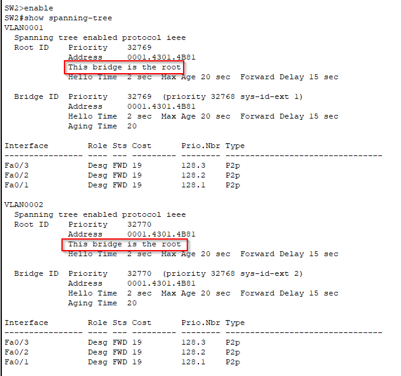
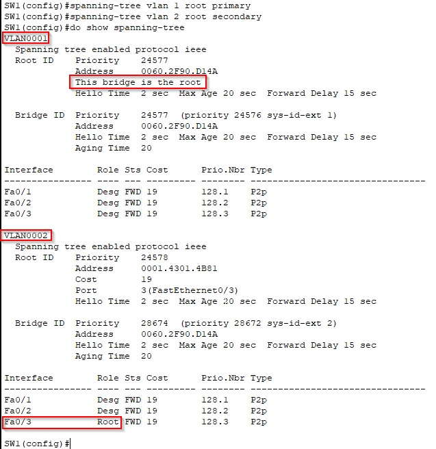
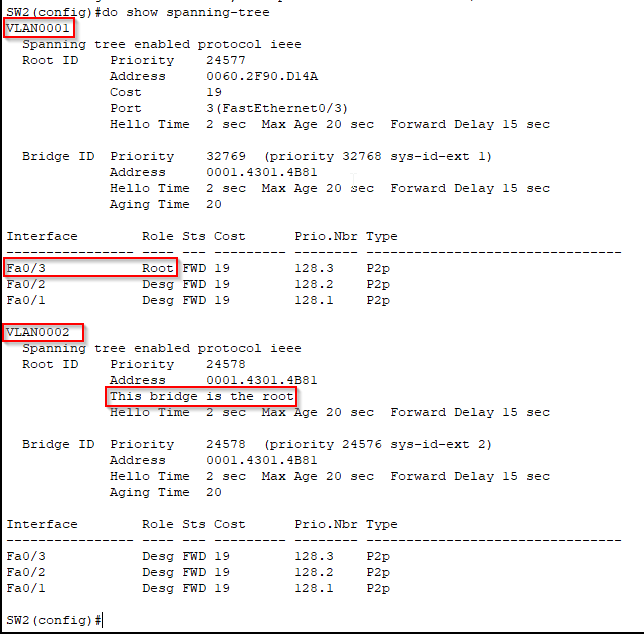
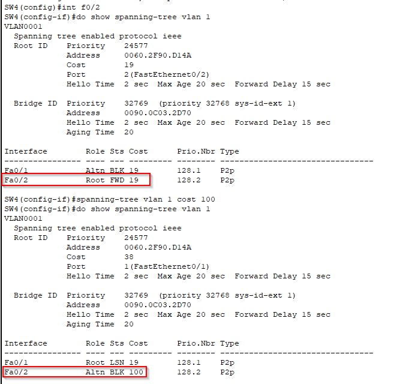
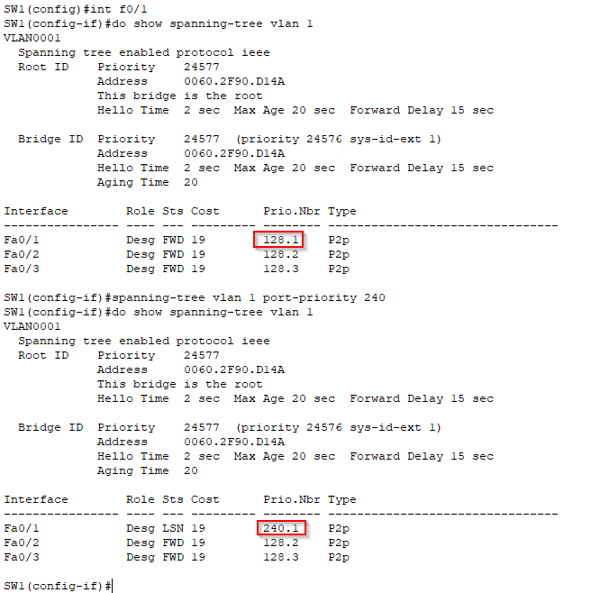
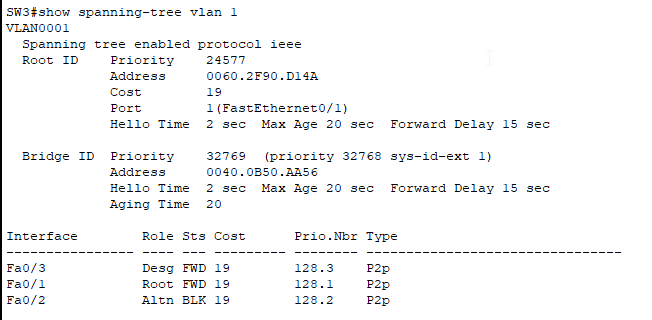
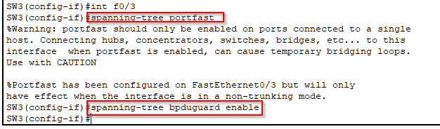
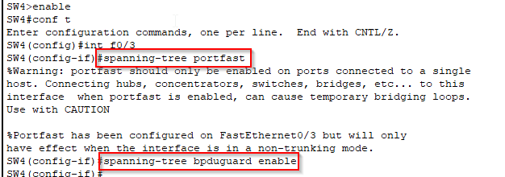

# Configuring Spanning Tree

## Project Overview

This project will help you learn how to manipulate STP roles and states within a network of switches, ensuring optimal traffic flow and redundancy.

  

## Objectives

## 1. Check Current STP Topology

- **Task**: Use the Command Line Interface (CLI) to check the current STP topology.
- **Questions**:
  - What is the current root bridge?
  - What is the STP role/state of each port on each switch?

## 2. Configure Root Bridges

- **Task**: 
  - Configure SW1 as the primary root for VLAN1 and the secondary root for VLAN2.
  - Configure SW2 as the primary root for VLAN2 and the secondary root for VLAN1.
- **Question**: What is the STP role/state of each port on each switch now?

## 3. Modify VLAN1 Cost

- **Task**: Increase the VLAN1 cost of SW4's F0/2 interface to 100.
- **Question**: Does SW4 select a different root port? Why or why not?

## 4. Modify Port Priority

- **Task**: Increase the VLAN1 port priority of SW1's F0/1 to 240.
- **Question**: Does SW3 select a different root port? Why or why not?

## 5. Configure PortFast and BPDU Guard

- **Task**: Configure PortFast and BPDU Guard on the F0/3 interfaces of SW3 and SW4.

### 1.1 Identify the Root Bridge:

By entering the CLI of any SW and entering the **show spanning-tree** command we can check if the selected Switch is the Root Bridge, if not, by looking 
at what interface the Root Port is connected we can assume the Switch connected to that interface is the Root Bridge.
For example let's open the CLI of SW1:

Since the Root Bridge and Bridge ID are not the same we know this is not the Root Bridge, however we notice that the Root Port on F0/3 is connected to 
SW2, which means SW2 will probably be the root bridge. Open the CLI of SW2 and check:

SW2 is currently the Root Bridge for both VLANs

### 1.2 Mapping the role/state of each port on each switch:

By opening the CLI for each Switch and entering the command **show spanning-tree** we can map out all the port roles and states on each interfaces:
(R - root, D - designated, N - non-designated).
Since no changes have been made the port roles/states are the same for both VLAN 1 and VLAN 2

- **SW1**
    
    F0/1: N  
    F0/2: D  
    F0/3: R  

- **SW2**

    F0/1: D  
    F0/2: D  
    F0/3: D  

- **SW3**
    
    F0/1: D  
    F0/2: R  
    F0/3: D  

- **SW4**

    F0/1: R  
    F0/2: N  
    F0/3: D  

### 2.1 Configure Root Bridge:

To configure SW1 to be the primary Root Bridge on VLAN 1 and the secondary Root Bridge on VLAN 2 we must open the CLI > conf t and use the command  
**spanning-tree vlan 1 root primary**  

and to make it the secondary Root Bridge on VLAN 2 we use the command  
**spanning-tree vlan 2 root secondary**  

Repeat the process for SW2:
- To make SW2 the VLAN 2 primary Root Bridge  
**spanning-tree vlan 2 root primary** 

and secondary Root Bridge of VLAN 1  
**spanning-tree vlan 1 root secondary** 

If we use the command **show spanning tree** on both switches we can se that SW1 is the primary Root Bridge for VLAN 1 and in VLAN 2 has F0/3 as a Root Port (which leads to SW2)

while in SW2 the VLAN 1 has F0/3 as its Root Port (which leads to SW1)   and in VLAN 2 it's the primary root bridge.

### 2.2 Mapping current roles and states of every port in each switch:

Now that we changed the primary and secondary Root Bridges, let's see how that affected each port of each switch:

VLAN 1:

- **SW1**
    
    F0/1: D  
    F0/2: D  
    F0/3: D  

- **SW2**
    
    F0/1: R  
    F0/2: D  
    F0/3: D  
 
- **SW3**
    
    F0/1: R  
    F0/2: N  
    F0/3: D  

- **SW4**
    
    F0/1: N  
    F0/2: R  
    F0/3: D  

VLAN 2:

- **SW1**
    
    F0/1: D   
    F0/2: D  
    F0/3: R  

- **SW2**
    
    F0/1: D  
    F0/2: D  
    F0/3: D  
 
- **SW3**
    
    F0/1: N  
    F0/2: R  
    F0/3: D  

- **SW4**
    
    F0/1: R  
    F0/2: N  
    F0/3: D  

### 3. Modify VLAN cost

We are tasked with modifying the SW4 VLAN 1 cost of port F0/2 to 100. In order to do so we open the CLI of SW4,
enter interface mode for f0/2 and use the following command:
**spanning-tree vlan 1 cost 100**

As we can see F0/2 was the Root Port but after the changes it became blocked and F0/1 became the Root Port.

### 4. Modify port priority

To increase the port priority of SW1's F0/1 to 240 on VLAN 1we use the command:
**spanning-tree vlan 1 port-priority 240**

We are then asked if this affects the selection of a Root Port for SW3, it shouldn't because port priority is the last tiebreaker,
the selection of the port priority is calculated first by selecting the lowest port cost, then comparing MAC addresses to see the lowest neighbouring number and
and only lastly by comparing the lowest port priority.

It does not, F0/1 is still the Root Port

5. Configure PortFast and BPDU Guard on F0/3 ports of SW3 and SW4:

## Conclusion

By manipulating STP parameters such as root bridge priority, port cost, and port priority, it is possible to achieve a deeper understanding of how STP operates and how to optimize network redundancy and traffic flow.
