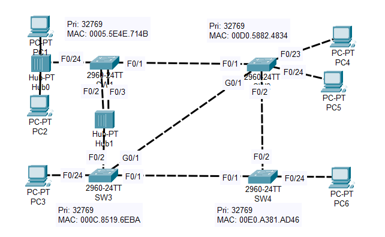
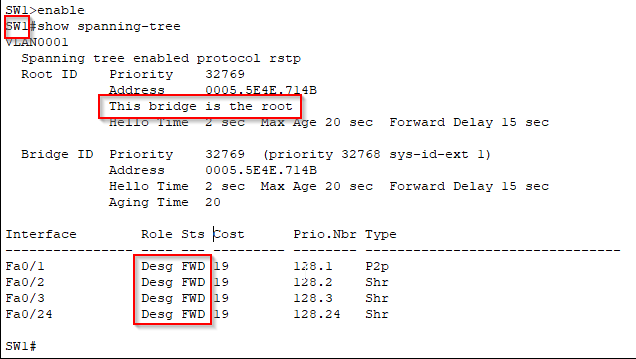
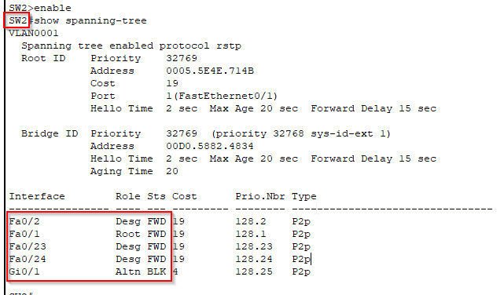
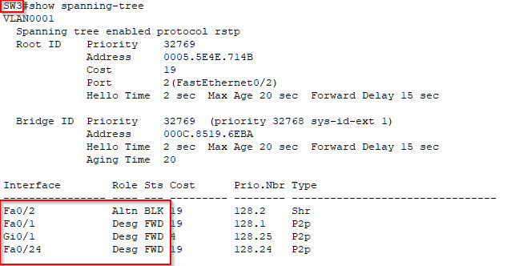
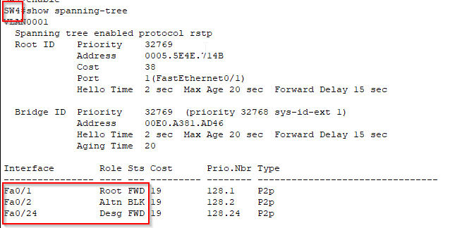
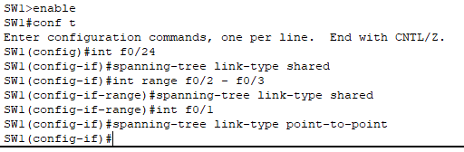
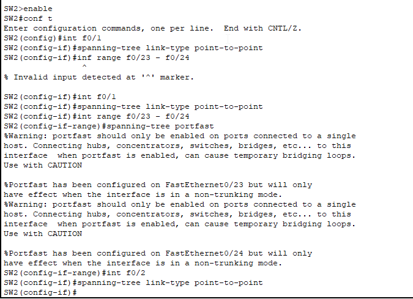
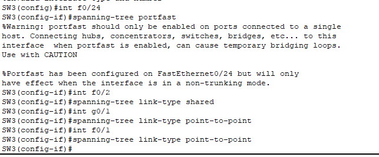
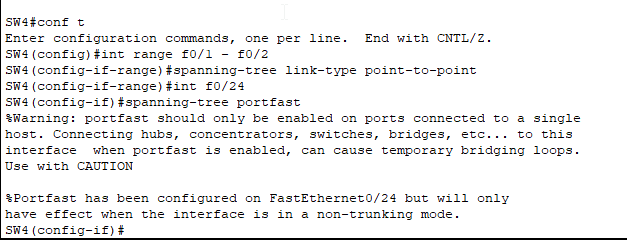

# Rapid STP

## Objectives

1. **Determine the root bridge**
2. **Examine the port role/state of each interface on the root bridge using the CLI**
   - Identify any differences from what you've learned about the root bridge
   - Determine the cause of these differences
3. **Without using the CLI, determine the port role/state of each remaining switch interface**
   - Confirm your findings using the CLI
4. **Manually configure the appropriate RSTP link type on each interface**
   - Determine the correct link type for SW1's F0/24

## Instructions

### 1. Determine the root bridge

Use the `show spanning-tree` command to identify the root bridge. The switch with the lowest bridge ID will be elected as the root bridge.

### 2. Examine the port role/state of each interface on the root bridge using the CLI

Use the `show spanning-tree interface` command to view the port role and state of each interface on the root bridge. Compare your findings with what you've learned about the root bridge:

- All ports on the root bridge should be designated ports in the forwarding state (except for F0/3 which is a backup port).
- If you observe any differences, investigate the cause. It could be due to a misconfiguration, a hardware issue, or a specific RSTP feature.

### 3. Determine the port role/state of each remaining switch interface

Without using the CLI, predict the port role and state of each interface on the non-root bridges based on your understanding of RSTP:

- One port on each non-root bridge will be the root port, providing the best path to the root bridge.
- The remaining ports will be designated ports if they are connected to a LAN segment with a lower root path cost than the other switches.
- If multiple ports connect to the same LAN segment, only one will be designated, and the others will be non-designated (blocked).

R - root port, D - designated port, A - alternate/blocked

- **SW2**

    F0/1 : R   
    F0/2 : D   
    F0/23: D   
    F0/24: D   
    G0/1 : A   

- **SW3**

    F0/1 : D    
    F0/2 : R    
    F0/24: D    
    G0/1 : D    

- **SW4**

    F0/1 : R   
    F0/2 : A   
    F0/24: D   
 
Confirm your predictions using the `show spanning-tree interface` command on each non-root bridge.

### 4. Manually configure the appropriate RSTP link type on each interface

RSTP can achieve faster convergence on point-to-point links, which are typically full-duplex links. Configure the link type manually if necessary:

- Use the `spanning-tree link-type point-to-point` interface configuration command to set the link type to point-to-point (switch to switch).
- Use the `spanning-tree link-type shared` if connected to a hub
- Use the `spanning-tree portfast` if connected to an end-host (PC)

### Conclusion
By completing these objectives, you will gain a deeper understanding of how RSTP elects the root bridge, determines port roles and states, and utilizes link types for faster convergence.
