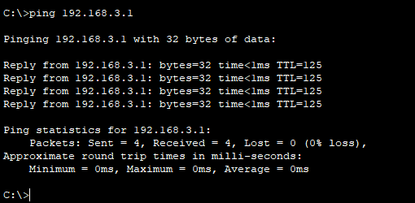

# Static Route Configuration 

## Project Overview
This project involves setting up a network with multiple devices, ensuring proper IP addressing, and configuring static routes to enable communication between different PCs.

  

## Objectives
1. Configure the PCs with appropriate IP addresses and gateways.
2. Configure the Routers hostnames and IP addresses.
3. Configure Static Routes on the routers so that PC1 can reach PC2.
4. Ensure successful connectivity testing between PCs.

## Configuration Steps

### 1. IP Address Configuration
- **PC1**
  - **IP Address:** `192.168.1.1`
  - **Subnet Mask:** `255.255.255.0`
  - **Gateway:** `192.168.1.254`

- **PC2**
  - **IP Address:** `192.168.3.1`
  - **Subnet Mask:** `255.255.255.0`
  - **Gateway:** `192.168.3.254`

Click on PC1 > config > global settings to set the default gateway (192.168.1.254)
PC1 > config > FastEthernet0 to set up the static IP (192.168.1.1)
Repeat process for PC2 

### 2. Router Configuration
- **R1** 
  

- **R2**

- **R3**

### 3. Static Route Configuration:
To enable PC1 to communicate with PC2, configure the following static routes on the router:

#### **From PC1 to PC2:**
- R1 Static Route:
If we want PC1 to be able to ping PC2 we have to configure a Static Route on R1 with the
network address of PC2, its subnet and the next-hop (R2's IP address), once set, confirm it 
with the appropriate command:	      

  

- R2 Static Route :
Next is the static route that connects R2 with R3:

#### **From PC2 to PC1:**
- R3 Static Route:
Create a Static Route connecting R3 to PC1 network using R2 as next-hop:

-R2 Static Route:
From R2 to PC1 network via R1 as next-hop

### 4. Connectivity Testing
- **Ping Test:**
  - From PC1, ping PC2 to check connectivity.
  - From PC2, ping PC1 to verify the route.

## Conclusion
This project demonstrates essential skills in network configuration, including IP addressing, static route setup, and connectivity testing
