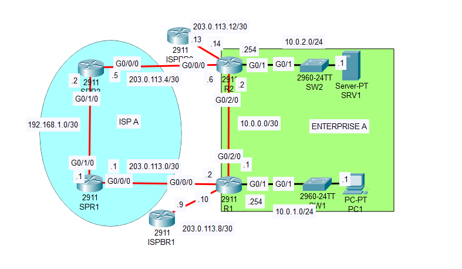

# Floating Static Routes 

## Overview

This project is designed to help users understand how floating static routes can be utilized to provide redundancy in network routing.

## Objectives

1. **Routing Table Analysis**
   - Check the routing tables of routers R1 and R2.
   - Identify the dynamic routing protocol used by Enterprise A.
   - Determine which route will be used when PC1 attempts to access SRV1.
   - Identify the route used when PC1 tries to access the remote server at 1.1.1.1 over the Internet.
   - Test connectivity by pinging SRV1 and 1.1.1.1.

2. **Configuration of Floating Static Routes**
   - Configure floating static routes on R1 and R2 to ensure that PC1 can reach SRV1 if the link between R1 and R2 fails.
   - Verify if the floating static routes appear in the routing tables of R1 and R2.

3. **Testing Failover**
   - Shut down the G0/2/0 interface of either R1 or R2.
   - Check if the floating static routes enter the routing tables of R1 and R2.
   - Confirm connectivity by pinging from PC1 to SRV1.

## Getting Started
### Instructions

1. **Check Routing Tables**:
- Identify the dynamic routing protocol used by Enterprise A
By accessing the CLI of R1 and R2 and using the command `show ip route` we can see the routing tables,  
on R1, the route 10.0.2.0/24 has the O flag, which stands for OSPF, so Enterprise A uses OSPF as its dynamic routing protocol <b>

- Determine which route will be used when PC1 attempts to access SRV1.				
Since PC1s default gateway is R1 let's check once again the routing table of R1. SRV1's address is 10.0.2.1, so we can see that the most specific route is 10.0.0.2 (R2)

- Identify the route used when PC1 tries to access the remote server at 1.1.1.1 over the Internet.
Since 1.1.1.1 is not in this network diagram it must be somewhere on the internet, so the only route that matches is the least specific, the default route,  
which is 0.0.0.0 via 203.0.113.9 (ISPBR1).
Opening up R2's routing table we can see that the default route 0.0.0.0 is accessed via 203.0.113.13 (ISPBR2), also note that we can access PC1s network  
via an OSPF route to 10.0.0.1 (R1)

2. **Configure Floating Static Routes**:
   - On R1 and R2, configure floating static routes with a higher administrative distance than the primary routes so that if the main route (OSPF) fails,  
	SRV1 can be reached via another static route. 
	
	Example command: `ip route [destination_network] [subnet_mask] [next_hop] [administrative_distance]`.
	In this case the destination network and subnet will be SRV1's network (10.0.2.0 255.255.255.0),
	the next-hop will be 203.0.113.1 (SPR1) and since OSPF has an AD of 110, we will set this route's AD to 111

Note that in the routing tables this route doesn't show, that is because the OSPF is still the preferred route (lower AD).

3. **Simulate Link Failure**:
   - Shut down the G0/2/0 interface on R1 or R2 using the command `shutdown`.
   - Check the routing tables again to see if the floating static routes are now active.
   - Ping SRV1 from PC1 to confirm connectivity through the floating static route.

## Conclusion

This project showcases the importance of floating static routes in providing backup paths in a network. 
