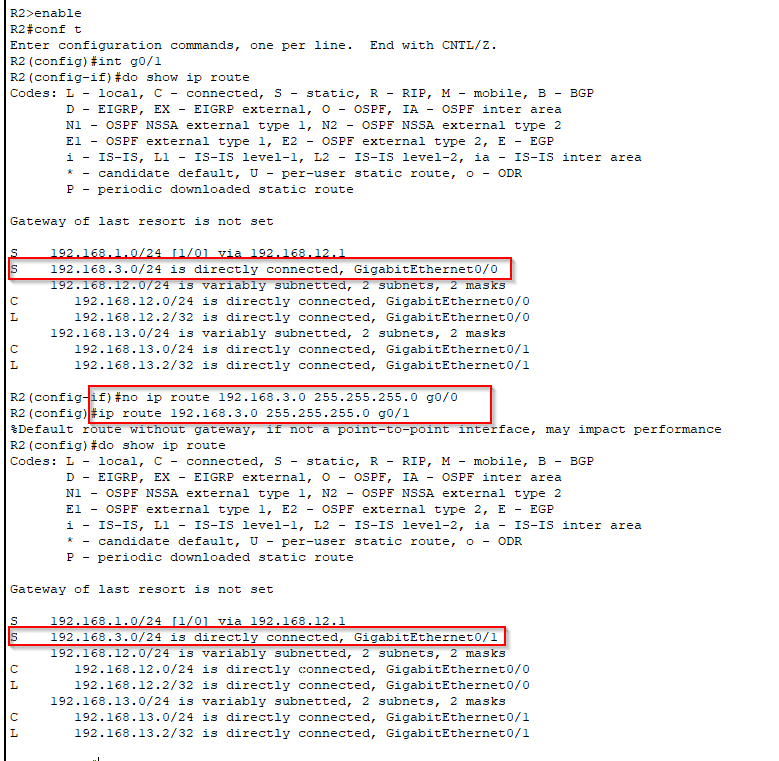

# Static Route Troubleshooting

## Project Overview
This project involves identifying misconfigurations that prevent proper communication between different network segments. 

## Objectives
1. Identify the misconfigurations
2. Test connectivity

## 1. Identifying the misconfigurations
- **R1**  
Opening up the CLI in R1 and using the command **show ip route** shows us that the static rotue to reach PC2 network
is wrong, we have to remove the misconfigured static route and add the correct one  

    192.168.3.0 255.255.255.0 192.168.12.2

 
- **R2**  
From the CLI if we use the command **show ip route** we can see that the static route configured for 192.168.3.0 has the wrong exit interface,
it should be g0/1 but it shows g0/0

- **R3**  
If we check the IP addresses with the command **show ip int brief** we notice that the IP address for g0/0 is incorrect.

## 2. Testing connectivity
Once all the misconfigurations are taken care of, we can ensure the network connectivity is functional by pinging from PC2 PC1 and viceversa.

## Conclusion
By methodically identifying and correcting misconfigurations on R1, R2, and R3, participants will not only enhance their technical skills 
but also gain confidence in their ability to resolve real-world networking issues.
