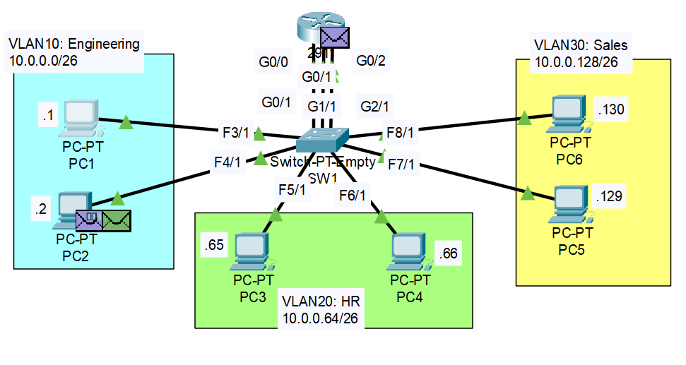

# VLAN Configuration 1

## Project Overview
The project involves setting up a network with multiple PCs, routers, and switches, ensuring proper IP addressing, VLAN configuration, and connectivity testing.

## Objectives
1. Configure the correct IP address and subnet mask on each PC, set the gateway address as the last usable address of the subnet.
2. Establish three connections between Router R1 and Switch SW1, configuring one interface on R1 for each VLAN, ensure the IP addresses are set as the gateway addresses for the PCs.
3. Configure SW1's interfaces to be part of the appropriate VLANs, and name the VLANs as Engineering, HR, and Sales.
4. Verify connectivity by pinging between the PCs and sending a broadcast ping to observe which devices respond.

## Project Components
- **Router:** R1
- **Switch:** SW1
- **PCs:** PC1, PC2, PC3 (located in different VLANs)

## Configuration Steps

### 1. IP Address Configuration
First we must configure the IP addresses and subnet for each PC, starting from PC1 and PC2, we know that the network address is 10.0.0.0 with subnet /26 (255.255.255.192)
so we will assign the first two usable addresses which are 10.0.0.1 for PC1 and 10.0.0.2 for PC2, to set the default gateway we need to calculate the last usable address
in the network, first we translate the IP into binary, 00001010.00000000.00000000.00000000, then we set the host bits (which are 6 given the subnet /26) to 1,
making the address 00001010.00000000.00000000.00111111, this translates to 10.0.0.63, which is the broadcast address, the last usable IP is the broadcast address -1
which is 10.0.0.62.
Click on the PC and go to the config tab, from the global menu we can assign the default gateway (10.0.0.63), selecting FastEthernet we can assign a static IP

Repeat the process for every PC

- **PC1 (Engineering)**
  - **IP Address:** `10.0.0.1/26`
  - **Subnet Mask:** `255.255.255.192`
  - **Gateway:** `10.0.0.62` (last usable address)

- **PC2 (Engineering)**
  - **IP Address:** `10.0.0.2/26`
  - **Subnet Mask:** `255.255.255.192`
  - **Gateway:** `10.0.0.62` (last usable address)

- **PC3 (HR)**
  - **IP Address:** `10.0.0.65`
  - **Subnet Mask:** `255.255.255.192`
  - **Gateway:** `10.0.0.126` (last usable address)

- **PC4 (HR)**
  - **IP Address:** `10.0.0.66`
  - **Subnet Mask:** `255.255.255.192`
  - **Gateway:** `10.0.0.126` (last usable address)

- **PC5 (Sales)**
  - **IP Address:** `10.0.0.129`
  - **Subnet Mask:** `255.255.255.192`
  - **Gateway:** `10.0.0.190` (last usable address)

- **PC3 (Sales)**
  - **IP Address:** `10.0.0.130`
  - **Subnet Mask:** `255.255.255.192`
  - **Gateway:** `10.0.0.190` (last usable address)

### 2. Router Configuration
- Connect R1 to SW1 using three physical interfaces.
- Configure the following interfaces on R1 for each VLAN:

  - **VLAN 10 (Engineering)**
    - **Interface:** `GigabitEthernet0/0`
    - **IP Address:** `10.0.0.62` 

  - **VLAN 20 (HR)**
    - **Interface:** `GigabitEthernet0/1`
    - **IP Address:** `10.0.0.126`
    
  - **VLAN 30 (Sales)**
    - **Interface:** `GigabitEthernet0/2`
    - **IP Address:** `10.0.0.190`

The IP for each interface will be the same we used for the default gateway of each VLAN, select the router and open the CLI, command enable to enter privileged mode and command configure terminal to enter config mode, then we enter each interface and configure the appropriate IP address and subnet, followed by the no shutdown command
to activate the interface.

Confirm the enstablished connections with **do show ip interface brief**

### 3. Switch Configuration
- Configure SW1's interfaces to be part of the appropriate VLANs:

  - **PC1 Connection (Engineering)**
    - **Interface:** `FastEthernet3/1`
  - **PC2 Connection (Engineering)**
    - **Interface:** `FastEthernet4/1`
    - **VLAN:** `10`
    
  - **PC3 Connection (HR)**
    - **Interface:** `FastEthernet5/1`
  - **PC4 Connection (HR)**
    - **Interface:** `FastEthernet6/1`
    - **VLAN:** `20`
    
  - **PC5 Connection (Sales)**
    - **Interface:** `FastEthernet7/1`
  - **PC6 Connection (Sales)**
    - **Interface:** `FastEthernet8/1`
    - **VLAN:** `30`

From the switch CLI > enable > configure terminal, from there we can configure all three interfaces at once (per VLAN), for example, VLAN10 involves g0/1, f3/1, f4/1.
the command to use is int range g0/1, f3/1, f4/1.  
Once in the int config mode we declare the connections as access ports with the command **switchport mode access**  
and assign the VLAN with the command **switchport access vlan 10.**  
Repeat the steps for VLAN 20 and VLAN 30

- Name the VLANs:
  - **VLAN 10:** Engineering
  - **VLAN 20:** HR
  - **VLAN 30:** Sales  

To name the vlan simply select the vlan from the switch CLI, for example vlan 10, followed by the command name ENGINEERING, repeat for vlan 20 and vlan 30  

### 4. Connectivity Testing
- **Ping Test:**
  - From PC1, ping PC3 and PC6 to check connectivity.

- **Broadcast Ping:**
  - Send a broadcast ping from one of the PCs to the subnet broadcast address (e.g., `10.0.0.63` for PC1).
  - Observe which devices respond using Packet Tracer's Simulation Mode.
As we can see in the image, if we ping the broadcast address of VLAN 10 (10.0.0.63) the only devices that receive the ping are the devices on VLAN 10, PC2 and 
R1.

## Conclusion
This project essential topics in network configuration, such as IP addressing, VLAN setup, and connectivity testing.
