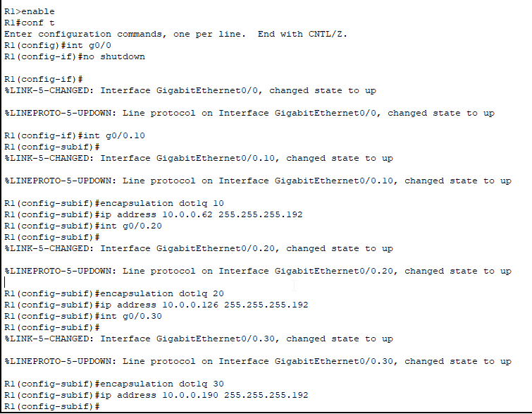

# VLAN Configuration 2 (ROAS)

## Project Overview
This project involves setting up VLANs, configuring switch ports, establishing trunk links between switches, and enabling inter-VLAN routing through a router. 

## Objectives
1. **Configure Access Ports**: Set up the switch interfaces connected to PCs as access ports in the correct VLAN.
2. **Configure Trunk Link**: Establish the connection between SW1 and SW2 as a trunk, allowing only the necessary VLANs. Configure an unused VLAN as the native VLAN, ensuring that all necessary VLANs exist on each switch.
3. **Implement Router on a Stick**: Configure the connection between SW2 and R1 using the Router on a Stick method. Assign the last usable address of each subnet to R1's subinterfaces.
4. **Test Connectivity**: Verify connectivity by pinging between PCs. Ensure that all PCs can reach each other across the VLANs.

## Network Diagram

## Configuration Steps

### Step 1: Configure Access Ports
- Access the switch configuration mode for each switch (SW1 and SW2).
- Assign the appropriate VLAN to each access port connected to the PCs.
#### SW1:

With these commands VLAN 10 and 30 are created on SW1

#### SW2:

With these commands VLAN 10 and 20 are created on SW2

### Step 2: Configure Trunk Link
- Set up the trunk link between SW1 and SW2, allowing only the necessary VLANs and configuring an unused VLAN as the native VLAN.

We enstablished the trunk links for VLAN 10 and 30 on SW1,
there is no need to configure VLAN 20 on this switch because if a packet from VLAN 20
must be sent to VLAN 10 or 30 it will first go to the router, routing it to tha approriate VLAN.
Finally we assigned the native VLAN to an unused VLAN (VLAN 1001)

With these commands we enstablished a trunk connection between SW1 and SW2,
also the native VLAN is set to 1001 just as in SW1

### Step 3: Implement Router on a Stick
- Configure the connection between SW2 and R1 using Router on a Stick. Assign the last usable address of each subnet to R1's subinterfaces.
First from SW2 we enter the int g0/2 mode (g0/2 connects SW2 with R1), and configure the vlan 10,20,30 as trunk links,
then we assing the native vlan to 1001.

Next we enter the R1 CLI, enter int g0/0, enable the interface with no shutdown,
create and activate the subinterfaces (g0/0.10, g0/0.20, g0/0.30) and assign them the last usable ip address for each VLAN

### Step 4: Test Connectivity
- Verify connectivity by pinging between PCs. Ensure that all PCs can reach each other across the VLANs.  
To test connectivity I opened the CLI of PC7 (VLAN 10) and from PC7 tried to ping PC1 on VLAN 10 (10.0.0.1), PC5 on VLAN 20 (10.0.0.64) and PC3 on VLAN 30 (10.0.0.129).
All pings were successful

## Conclusion
Successful configuration and testing will ensure that all PCs can communicate effectively, demonstrating the importance of proper VLAN setup in network design.
