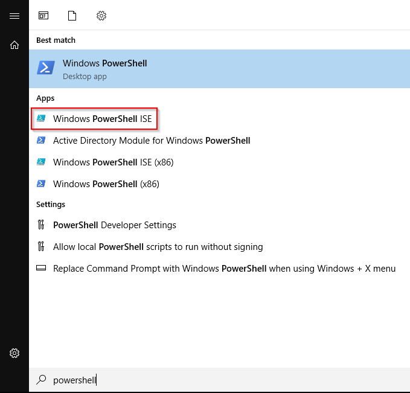
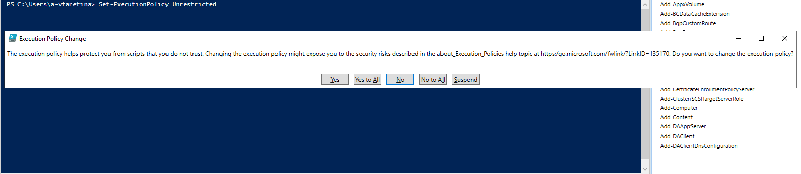
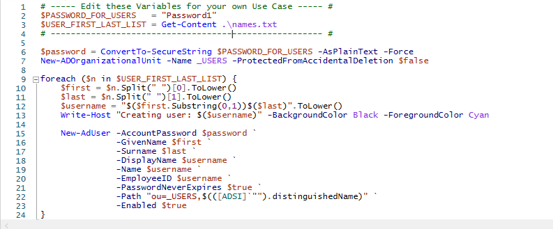
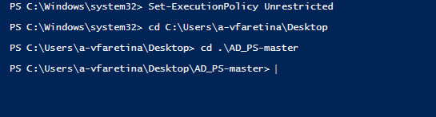
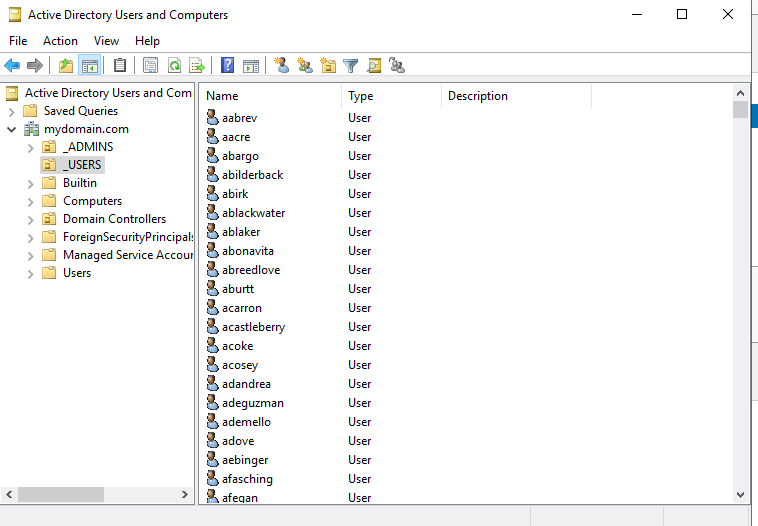

# Running PowerShell scripts
## Set execution-policy

By default there is a security feature that doesn't allow Windows to run PS scripts, in order to be able to run our scripts we have to change the execution policy.
First we open Windows PowerShell Integrated Scripting Environment (ISE) as Administrator from the start menu. PowerShell ISE lets developers run PowerShell commands and create, test and refine PowerShell scripts without operating directly in the traditional PowerShell command-line interface.

From the PS ISE we can change th execution policy with the command **set execution-policy unrestricted**, we are using unrestricted in this case because it's a lab environment but in real world scenarios it is best to set the execution policy to **RemoteSigned**, so that 
locally created scripts can be run without a digital signature while any scripts downloaded from the internet are required to be signed by a trusted publisher.
 

## Analyzing the script

Now that we can run our script, I will use as an example a script that allows us to generate 1000 users (with respective first, last name and password), automating the process instead of doing it manually.

The first thing to do is define our variables:  
- **$PASSWORD_FOR_USERS = "Password1"** 
    - will be the password for each account  
- **$USER_FIRST_LAST_LIST = Get-Content .\names.txt**
    - takes all the names from the  and stores them inside the variable as an array.

- **$password = ConvertTo-SecureString $PASSWORD_FOR_USERS -AsPlainText -Force** 
    - takes the plain text we stored in $PASSWORD_FOR_USERS (Password1) and turns it into an object that powershell can use as a secure password (it will be used when we will create the users in AD).  
- **New_ADOrganizationalUnit -Name _USERS -ProtectedFromAccidentalDeletion $false** 
    - creates the OU called _USERS  
- **foreach ($n in $USER_FIRST_LAST_LIST) {...}** 
    - is a for loop that takes every element in the $USER_FIRST_LAST_LIST and runs the whole block of code for each individual user in this list  
- **$first = $n.Split(" ")[0].ToLower()** and **$last = $n.Split(" ")[1].ToLower()** 
    - are going to respectively split the name at the space (" ") dividing the first from last name and storing both in a variable (first at index [0] and last at index[1])  
- **$username = "$($first.Substring(0,1))$($last)".ToLower()** 
    - creates a username by taking the first character from $first and the whole $last name (for example if the name is "Vito Faretina", the username will be "vfaretina")  
- **Write-Host "Creating user: $($username)" -BackgroundColor Black -ForegroundColor Cyan** 
    - outputs to the terminal that it's creating the username  
- **New-AdUser** 
    - creates a user and stores it in the _USERS OU in Active Directory, the rest of the command are the parameters for the user: 
	
	**-AccountPassword $password**   
	- gives the user the password stored in $password (which is the "Password1" we initially stored in $PASSWORD_FOR_USERS)
    
    **-GivenName $first**   
	- sets the first name of the user 
	
	**-Surname $last**   
	- sets the last name
	
	**-DisplayName $username**, **-Name $username**, **-EmployeeID $username**  
	- are all going to use the username defined in $username
	
    **- PasswordNeverExpires $true**  
	- (not recommended in real world scenarios) sets the password to never expire
	
	**-Path "ou=_USERS,$(([ADSI]"").distinguishedName)"**  
	- tells the script to store this user in the _USERS OU
	
	**-Enabled $true**   
	- activates the user account 

## Running the script

Once the script is set, in order to run it it is best if we enter the folder where the script is located, in this case my script is in a folder on the Desktop.  
To access the script for powershell run **cd path\to\directory**, in this case **cd C:\Users\a-vfaretina\Desktop\AD_PS-master**

To run the script simply type the name of the script with its full path, in this case **C:\Users\a-vfaretina\Desktop\AD_PS-master\1_CREATE_USERS.ps1**.  
Once the script starts it will display the various users it's creating.

 

If we open the Active Directory Users and Computer windows we can see that the **_USERS** OU has been created and it's populated with all the users we created with the script.

