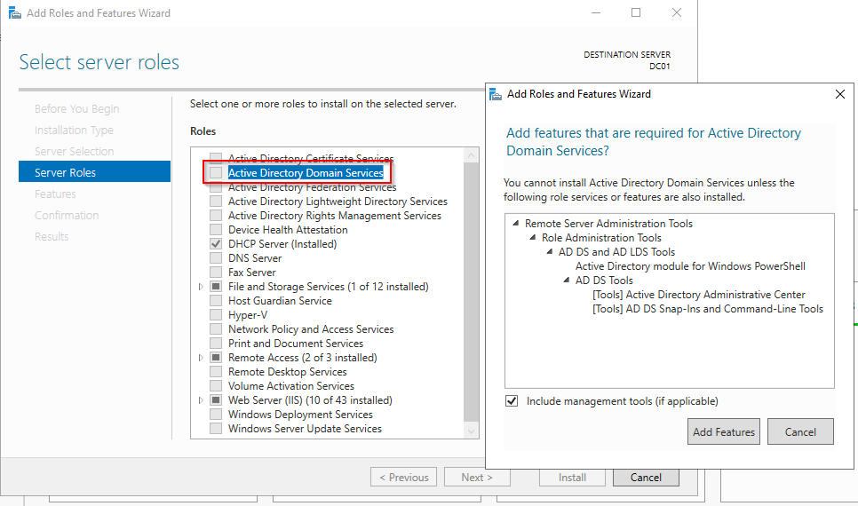
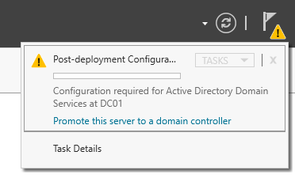

# Setting up an Active Directory Domain Controller

## Install Active Directory Domain Services

From the main dashboard, select add roles and features and install **Active Directory Domain Services** 

Next, select the flag with the yellow warning sign (top right) and select promote this server to a Domain Controller:

## Deployment Configuration

Once in the Active Directory Domain Services configuration wizard, select **create new forest** and insert the domain of that forest (the domain can have any name possible, for the sake of this lab we will call it mydomain.com)

Continue with the configuration until you finish the install, you will need to restart the server to complete the installation.

## Setting up our own dedicated Domain Admin account

Instead of using the built-in Admin account, it's best to set up an Active Directory Domain Admin account, to do so sele Windows Administrative Tools from the start menu > Active Directory Users and Computers

From the left toolbar right click on mydomain (the forest name you selected) and create a new Organizational Unit for the Admin. Organizational Units (OUs) 
are essential for organizing and managing Active Directory resources efficiently and securely. They are basically container objects used to organize and manage various resources within a domain, 
such as user accounts, computer accounts, printers, groups, and other Active Directory objects.

Once the container **_ADMINS** we can proceed in creating our Admin user , right click on the _ADMINS folder, select new user and input the users data (First and Last Name, etc.).
Next we grant that user Admin privileges by right clicking on the user > select properties > select member of tab > add domain admins > select apply

To use it, log out of the current session, in the startup screen select other users (bottom right) and login with the Domain Admin credentials.

 
