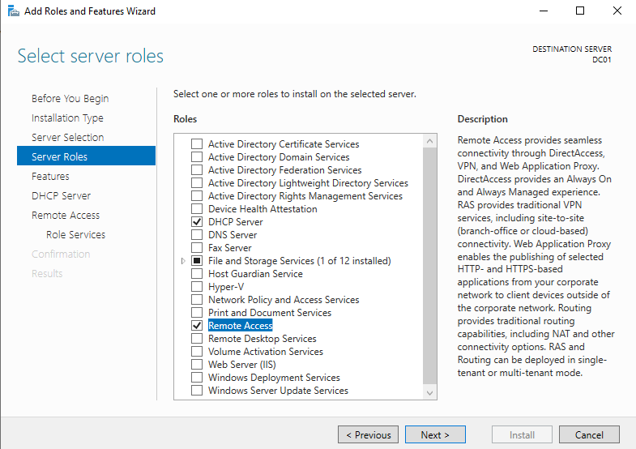
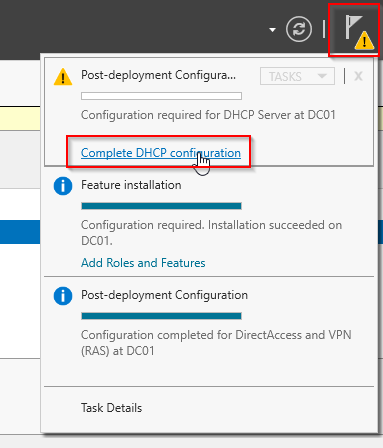
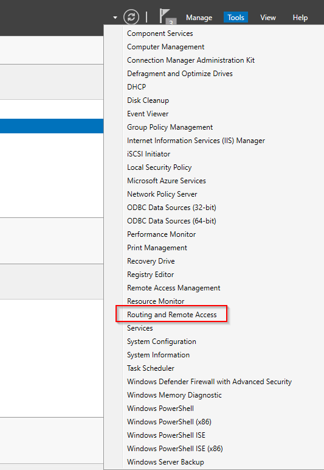
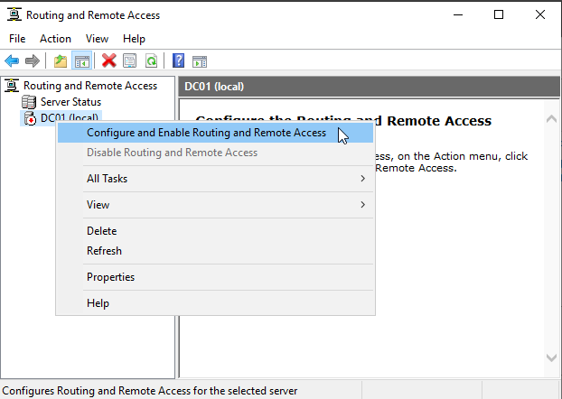
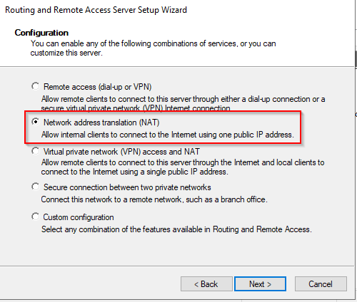
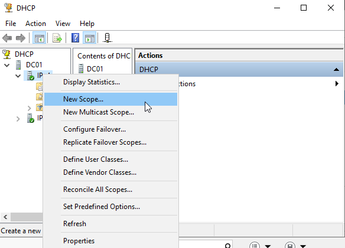
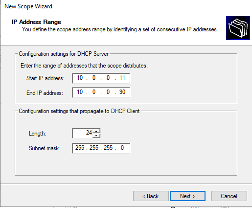
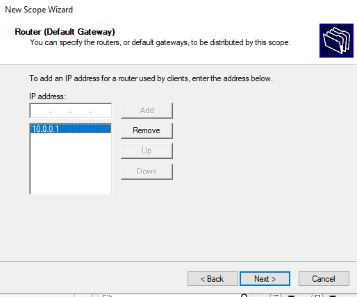
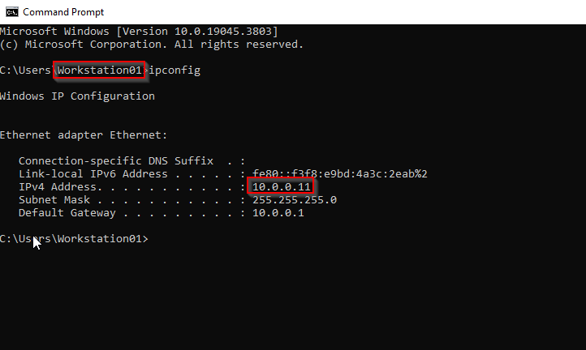

# DHCP Server Management

## What is a DHCP Server?

A DHCP (Dynamic Host Control Protocol) Server is used to assign IP address dinamically to all the hosts connected to the internal network.
Configuring a DHCP with access and routing it is possible to use a single server to connect all hosts in the network without the need to manually configure them.

## Installing the DHCP Server

If we want to turn a Windows Server machine into a DHCP server we can do so by selecting **Add roles and Features** from the main Server Manager dashboard 
and select **DHCP Server** and **Remote Access**

Next click on the flag (top right) from the Server Management and click on complete DHCP configuration

## NAT Configuration

NAT allows multiple devices on a local network to share a single public IP address when accessing external networks, such as the Internet. 
This is particularly important given the limited availability of IPv4 addresses. 
By using NAT with DHCP, you can efficiently manage your internal IP address space while still providing Internet access to all devices.

To configure NAT from **Tools** (top right) select **Routing and Remote Access**, next right click on DC01 and select **Configure and Enable Routing and Remote Access**,
select NAT, then select the IP that has DHCP between parenthesis and finish.

## DHCP Configuration

After the NAT configuration, we can begin the DHCP configuration. From the left menu toolbar select DHCP > right click on DC01 > DHCP Manager.
From the DHCP Manager expand the nodes > right click on IPv4 > new scope.

From the new scope wizard we will be able to configure the IP range (and subsequent subnetmask) that the DHCP can assign, apply potential restrictions
(for example if in that range there are IP addresses that we wish to assign as static) and assign the IP address of the NIC that we want to use as DHCP (for this specific case will be 10.0.0.1)

## Test DHCP address assignment 

To make sure the DHCP is working as intended, connect a second machine in the internal network and use the command **ipconfig**, 
if the DHCP works correctly we will see the IP address of the workstation 
will be 10.0.0.11 (the first address available in the IP range)

We can also test internet connectivity of the Workstation by pinging 8.8.8.8/google.com, if the NAT is configured correctly the workstation will go through DC01 and access the internet.

